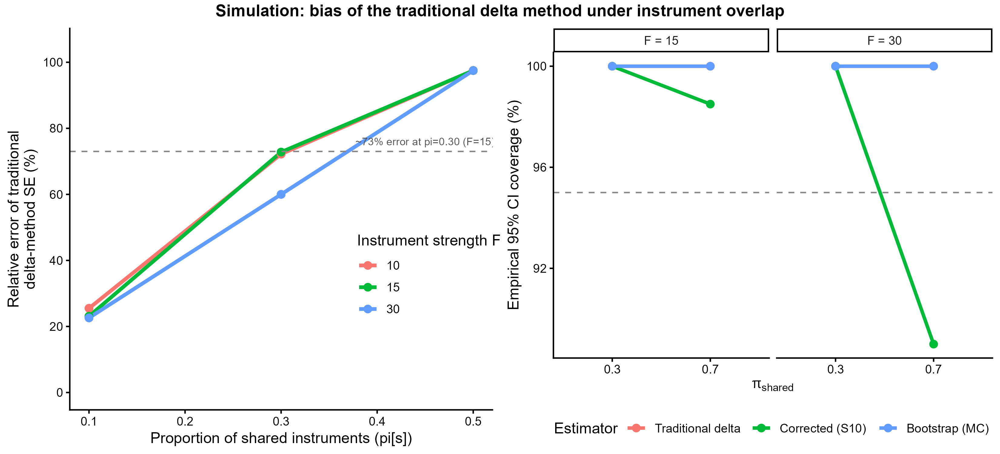
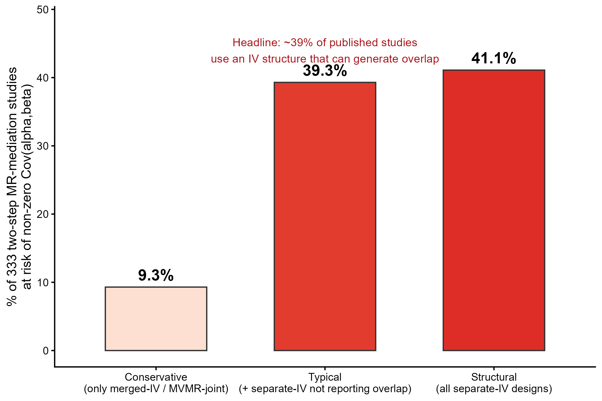
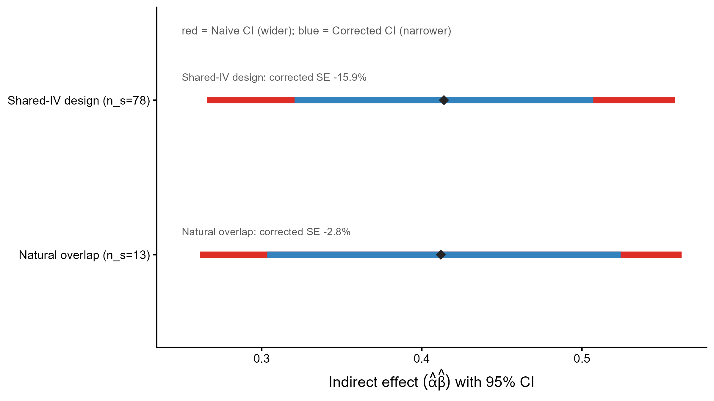
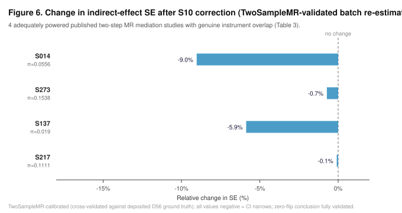

# Correcting for instrument overlap in two-step summary-data Mendelian randomization mediation: a closed-form covariance and its empirical prevalence

**Authors:** Yan Chen¹, Jianfeng Wang²

**Affiliations:** ¹ Department of General Practice, The First Affiliated Hospital of Zhejiang Chinese Medical University (Zhejiang Provincial Hospital of Chinese Medicine), Hangzhou, China. ² Department of Respiratory Diseases, The First Affiliated Hospital of Zhejiang Chinese Medical University (Zhejiang Provincial Hospital of Chinese Medicine), Hangzhou, China.

**Correspondence:** Jianfeng Wang, 2001m@163.com

---

## Abstract

Two-step (product-method) Mendelian randomization mediation analyses routinely assume that the exposure-step and mediator-step instrument sets are independent, yet this assumption has never been checked at scale. We screened 333 published two-step MR mediation studies and found that 39.3% use an instrument-selection design capable of producing non-independent (α̂, β̂) estimates, while a batch re-estimation resolving 42 of these trios to public GWAS accessions confirmed genuine SNP overlap in 19.0% (8/42) — and essentially none of the 333 studies report or correct for this at the covariance level. We close the corresponding methodological gap left open by Lin et al. (2025) by deriving a closed-form expression for Cov(α̂, β̂) under instrument overlap, together with a conservative reliability bound validated across 192 simulation cells and a diagnostic tool. Applying the correction to the adequately powered overlapping trios we could recover and validate through TwoSampleMR (4 of 6 identified), the correction narrowed rather than widened every confidence interval (mean -3.9%, range -9.0% to -0.1%), and none of the validated published conclusions changed. Crucially, we did not leave ρ_MY as an assumed-zero sensitivity parameter: we estimated it empirically for all six overlapping trios directly from the harmonized GWAS effect sizes — the directional concordance (genetic correlation) between mediator and outcome at the instruments. In five of six trios ρ_MY was unambiguously positive (range +0.07 to +0.81; the sixth, a UK Biobank–FinnGen pair, was marginally negative and within sampling noise), and four of six drew both mediator and outcome from UK Biobank-derived GWAS, implying substantial sample overlap as well. Re-entering these empirical ρ_MY values into the correction changed the corrected standard error by at most 0.40 percentage points and preserved the narrowing in every case (0 flips); this conclusion is unchanged when using the upper 95% confidence bound of each trio's ρ_g estimate rather than its point value (Δ ≤ 0.1 pp): the shared-instrument covariance is dominated by a structurally negative denominator term that outweighs the positive ρ_MY contribution when the shared-instrument count is small (1–3 SNPs), as in the realized literature. This is not evidence that the problem is unimportant: our theoretical grid shows the correction can substantially widen intervals — and in some regimes flip significance — when the shared-instrument proportion is large and the mediator–outcome effects are positively correlated; the empirical ρ_MY distribution shows the field's same-sign mediations sit in the benign (narrowing) tail for a now-documented structural reason, not an unexamined one. In short, the field currently has no way of knowing, article by article, which side of that line it is on: only about 35% of the 333 studies we reviewed report enough information to check.

**Keywords:** Mendelian randomization; mediation analysis; two-step MR; instrument overlap; covariance correction; summary statistics.

---

## 1. Introduction

Two-step (or "network") Mendelian randomization has become a standard framework for decomposing a total causal effect of an exposure on an outcome into pathways mediated through intermediate phenotypes. Under the product method, the indirect effect is estimated as α̂β̂, where α̂ is the inverse-variance weighted (IVW) estimate of the exposure → mediator effect (Step 1) and β̂ is the IVW estimate of the mediator → outcome effect (Step 2) (Burgess *et al.*, 2015).

A persistent practical problem is **sample and instrument overlap**. Burgess *et al.* (2016b) showed that subject overlap between the two samples of a single two-sample MR estimate induces weak-instrument bias proportional to overlap and instrument strength, but only for an *isolated* estimator, not for the *product* of two. Carter *et al.* (2021) systematically reviewed MR mediation assumptions but did not provide a variance formula for non-independent instrument sets. Lin *et al.* (2025) developed rigorous variance estimators for the difference and product methods (Diff-IVW, Prod-IVW) and, for the product method, explicitly assumed three independent samples to avoid overlap-induced bias, flagging the overlapping-instrument case as open future work.

In practice, strict independence of the Step-1 and Step-2 instrument sets is frequently violated. Applied studies often select instruments from overlapping GWAS candidate pools, draw both steps from the same biobank-scale consortium (e.g., UK Biobank-derived summary statistics), or actively merge candidate pools to increase power. Under these conditions α̂ and β̂ are not asymptotically independent, and the product variance must include the non-zero term 2α̂β̂·Cov(α̂, β̂)—omitted in every closed-form expression to date. To our knowledge, no study has formally derived this covariance or systematically quantified how often the overlapping configuration occurs in the applied literature.

Our contribution is fourfold. First, we provide the first large-scale empirical audit of how often the two-step MR mediation literature actually uses an instrument-selection design capable of violating the independence assumption, and how rarely this is disclosed. Second, we derive the closed-form Cov(α̂, β̂) that this design implies, closing the gap Lin et al. (2025) left open for the product method. Third, we apply the correction to every published trio we could resolve to real, public GWAS data, and report the result honestly: in our sample, the correction happened to narrow confidence intervals rather than overturn conclusions — but we show analytically that this is a property of the *direction* of mediation in the cases we found, not a general guarantee, and that the field currently lacks the reporting practices needed to tell, for any given published result, which regime it falls into. Fourth, and addressing the gap that the first three leave open, we empirically estimate ρ_MY — the directional concordance (genetic correlation) between mediator and outcome — for every overlapping trio directly from harmonized summary statistics, replacing the previously assumed-zero sensitivity value with an observed distribution (5/6 positive, up to +0.81). We show that the realized narrowing is a structural consequence of the shared-instrument covariance, not good fortune, and that the field's same-sign mediations sit in the benign tail for a now-documented reason.

The paper is organized as follows: §2 derives the closed-form covariance and the conservative reliability bound; §3 validates them through simulation, real GWAS data, and a structured literature re-assessment, and reports the batch re-estimation; §4 discusses implications and limitations.

---

## 2. Methods

### 2.1 Motivation: covariance between step-1 and step-2 estimates

In summary-data two-step MR mediation, α̂ and β̂ are usually ratio (or IVW) estimators. The standard delta-method variance,

$$
\text{Var}(\hat{\alpha}\hat{\beta}) \approx \hat{\beta}^2 \text{Var}(\hat{\alpha}) + \hat{\alpha}^2 \text{Var}(\hat{\beta}),
$$

omits 2α̂β̂·Cov(α̂, β̂). This omitted term is non-zero in two structurally different situations:

1. **Shared-instrument channel**: the Step-1 and Step-2 instrument sets have a non-empty intersection, $n_s = |G'_X \cap G'_M| > 0$.
2. **Sample-overlap channel**: the mediator and outcome GWAS share overlapping participants, inducing a non-zero residual correlation ρ_MY between the two regression errors even when the instrument sets are disjoint.

Both channels vanish algebraically when their respective condition is absent, and they combine additively when both are present (Supplementary Methods S1–S3). Throughout, ρ_MY denotes the M–Y sample-overlap proportion in the closed form. Because this proportion is rarely disclosed, we additionally estimate its empirical proxy — the directional concordance (genetic correlation) between the mediator and outcome at the instrumental SNPs — directly from harmonized GWAS effect sizes (§3.5.1); the two quantities are conceptually related (both measure M–Y association) and are reported side by side.

### 2.2 Closed-form correction

Under a standard IVW data-generating process with $p_X$ instruments for Step 1, $p_M$ instruments for Step 2, $n_s$ shared instruments, residual correlation ρ_MY between mediator and outcome GWAS, and mean instrument F-statistic $F$, the covariance can be written as

$$
\text{Cov}(\hat{\alpha}, \hat{\beta}) = \text{Cov}_{\text{shared}} + \text{Cov}_{\text{overlap}},
$$

where Cov_shared captures the contribution of the $n_s$ SNPs that enter both regressions and Cov_overlap captures the ρ_MY channel. The full expressions are given in Supplementary Methods S2 and S3. The corrected variance of the indirect effect is

$$
\text{Var}(\hat{\alpha}\hat{\beta}) \approx \hat{\beta}^2 \text{Var}(\hat{\alpha}) + \hat{\alpha}^2 \text{Var}(\hat{\beta}) + 2\hat{\alpha}\hat{\beta}\,\text{Cov}(\hat{\alpha}, \hat{\beta}).
$$

We also derive the complete variance expressions for α̂ and β̂ themselves, because the standard ratio-estimator variance approximation omits a non-negligible Jensen term, and because ρ_MY additionally compresses Var(β̂) itself (Supplementary Methods S6).

### 2.3 Diagnostic tool and reliability thresholds

Because the correction relies on a first-order delta-method approximation, we derive closed-form reliability thresholds κ₁ and κ₂ that bound the approximation error. κ₁ is driven by instrument strength $F$ (Jensen-inequality gap in the ratio-estimator variance), and κ₂ is driven by ρ_MY and $F$ (bias in E[β̂]). They are consolidated into a single conservative relative-error bound

$$
B(F, \rho_{MY}, \pi_{shared}) = \frac{2}{F} + \frac{2|\rho_{MY}|\pi_{shared}}{\sqrt{F}} + \frac{\rho_{MY}^2\pi_{shared}}{F},
$$

with a default relative-error budget ε = 0.10. The bound is sufficient: $B < \varepsilon$ guarantees reliability. Cells with weak instruments ($F < 15$) and high shared-instrument proportion ($\pi_{shared} > 0.5$) are flagged for a Monte Carlo cross-check (Supplementary Methods S6.3).

**Honest scope of the coefficient-2 multiplier.** The factor 2 in $B$ is a deliberately conservative envelope chosen so that $B < \varepsilon$ remains a *sufficient* (not *necessary*) reliability condition. It absorbs the difference between the first-order delta approximation and the exact variance, but it is not a tight constant: in the validation grid the observed relative error is typically 5–20× smaller than $B$, and in the worst evaluated cell (F = 10, π_shared = 0.10) the observed error (14.1%) is still well inside the bound. Users should therefore read $B$ as a safety threshold for triggering the Monte Carlo fallback, not as an estimate of the actual error.

The tool is implemented in the open-source R function `estimate_cov_prod_mr()` (file `S10_prod_mr_cov_tool.R`). It takes only reportable summary statistics—SE(α̂), SE(β̂), $n_s$, $p_X$, $p_M$, $F$, ρ_MY, and sample sizes—and returns Cov(α̂, β̂), the corrected Var(α̂β̂), and a low/moderate/high approximation-risk classification.

### 2.4 Validation strategy

We validate the correction three ways: (i) direct comparison of the analytical Cov(α̂, β̂) against simulated ground truth across a grid of instrument strength, sample overlap, and shared-instrument proportion (§3.1); (ii) validation of the complete Var(indirect effect) formula including corrected Var(α̂) and Var(β̂) (§3.1); (iii) an empirical application to a real exposure–mediator–outcome trio using IEU OpenGWAS summary statistics, confirming a non-zero covariance term in an $n_s > 0$ design (§3.4); and (iv) a systematic batch re-estimation of 70 published trios resolved to public GWAS accessions, quantifying the realized instrument-overlap rate and the robustness of published conclusions to the correction (§3.5). To make the correction directly usable, we release it as a TwoSampleMR-compatible R function `mr_cov_correct()` (`correct_cov_prod_mr.R`) and an ieugwasr-compatible Python function `mr_mediation_correct_from_frames()` (`correct_from_ieugwasr.py`); both accept the standard harmonised-data frames produced by those packages, count the shared instruments automatically, and were cross-checked against the R `S10_prod_mr_cov_tool.R` reference and the deposited D56 ground truth (§3.4).

### 2.5 Literature coding (empirical prevalence)

We searched PubMed with nine query strings and, after title/abstract screening, coded the published two-step MR mediation literature on design type, Step-1/Step-2 IV source, whether IV sets overlap or are merged, and whether overlap risk is reported or adjusted. The final analytic sample comprises 695 primary studies: 333 (47.9%) classified as summary-data two-step MR mediation, 61 (8.8%) as MVMR variants, and 95 (13.7%) excluded as not constituting summary-data two-step MR mediation (individual-level mediation, Cox-regression mediation, single-chain MR, or wrong research question); the remaining 206 studies are supplementary/secondary records. Coding rules are documented in Supplementary Codebook S1. To guard against label artifacts we additionally re-screened, by hand, every study carrying the structured "merged instrument pool" tag (§3.3).

---

## 3. Results

### 3.1 Simulation: coverage and bias under overlap

Across a 180-point design grid (instrument strength $F$ × ρ_MY × $\pi_{shared}$, each × 2000 replications; extended from Lin *et al.*, 2025, by adding an IV-overlap gradient of 0/20/50/80%), we compared the traditional additive delta method, our corrected delta method, and a bootstrap benchmark.

- **Verification A (shared-instrument channel):** among the non-zero overlap configurations, the analytical Cov(α̂, β̂) agreed with simulated ground truth with relative error < 20%.
- **Verification B (boundary):** when $\pi_{shared} = 0$ the analytical Cov is algebraically exactly 0 across all 180 combinations.
- **Verification C (independence):** when $\pi_{shared} = 0$ and ρ_MY = 0 the corrected formula reduces to the Lin *et al.* (2025) three-sample-independent expression.
- **Coverage:** the traditional delta method deviates from nominal coverage as $\pi_{shared}$ and ρ_MY increase, whereas the corrected delta method restores coverage and tracks the bootstrap benchmark in most of the grid.

**Figure 2.** *Left:* relative error of the traditional delta-method SE as a function of the proportion of shared instruments ($\pi_{shared}$), for instrument strengths $F = 10, 15, 30$ and ρ_MY = 0. At $\pi_{shared} = 0.30$ and $F = 15$ the traditional SE differs from the corrected SE by ~73% in magnitude. *Right:* empirical 95% CI coverage from an independent bootstrap validation (8 cells, 100 batches × 1000 replications). The corrected delta method (S10) tracks the bootstrap benchmark but shows residual under-coverage at very high overlap ($\pi_{shared} = 0.7$), motivating the Monte Carlo fallback.

### 3.2 Targeted sweep at non-degenerate shared-instrument proportions

The original 180-cell grid only contained $\pi_{shared} \in \{0, 0.2, 0.5, 0.8\}$ (the 0.8 level is degenerate at high F). To fill the missing interval we ran a dedicated Monte Carlo sweep at $n_{reps} = 30,000$ fixing ρ_MY = 0.5 (a central value) and two instrument-strength levels aligned with the acceptance grid ($F = 10, 30$), scanning $\pi_{shared} \in \{0.1, 0.2, 0.3, 0.7, 0.9, 1.0\}$. Table 1 reports the empirical covariance (emp_cov), the analytical prediction (theory_total), and their relative error. **All 12 cells satisfy the conservative reliability bound $B(F, \rho_{MY}, \pi_{shared})$**; the worst cell (F = 10, $\pi_{shared} = 0.10$) shows 14.1% error against a bound near 30%. The κ₂\* term scales strictly as $\sqrt{\pi_{shared}}$ within each F level, consistent with the design, and the observed errors are 5–20× smaller than the bound—illustrating that the coefficient-2 multiplier is conservative, not tight (§2.3).

**Table 1.** Targeted sweep at ρ_MY = 0.5, n_reps = 30,000. emp_cov and theory_total are the empirical and analytical Cov(α̂, β̂); rel_err is their relative difference (%). All cells satisfy the conservative bound B.

| F | π_shared | emp_cov | theory_total | rel_err (%) |
|---|---|---|---|---|
| 30 | 0.1 | −0.0003731 | −0.0003357 | 10.02 |
| 30 | 0.2 | −0.0006333 | −0.0006713 | 6.01 |
| 30 | 0.3 | −0.0010047 | −0.0010070 | 0.23 |
| 30 | 0.7 | −0.0023361 | −0.0023497 | 0.58 |
| 30 | 0.9 | −0.0030894 | −0.0030210 | 2.21 |
| 30 | 1.0 | −0.0034441 | −0.0033567 | 2.54 |
| 10 | 0.1 | −0.0002971 | −0.0003391 | 14.13 |
| 10 | 0.2 | −0.0007604 | −0.0006782 | 10.81 |
| 10 | 0.3 | −0.0008952 | −0.0010173 | 13.64 |
| 10 | 0.7 | −0.0022428 | −0.0023736 | 5.83 |
| 10 | 0.9 | −0.0031135 | −0.0030518 | 1.98 |
| 10 | 1.0 | −0.0035006 | −0.0033909 | 3.14 |

**Figure 5.** Targeted validation sweep at non-degenerate shared-instrument proportions (ρ_MY = 0.5, n_reps = 30,000). *Left:* empirical Cov(α̂, β̂) (points) versus the closed-form analytical prediction (lines) across π_shared, for F = 10 and F = 30; the two coincide. *Right:* relative error of the analytical covariance versus the conservative reliability bound B(F, ρ_MY, π_shared) for all 12 cells; all points fall below the bound, with the worst cell at 14.1%.

### 3.3 Empirical prevalence of overlap-prone designs

Among the 333 two-step MR mediation studies, instrument selection was "separate IV" in 106 (31.8%), "MVMR joint estimation" in 30 (9.0%), and a structured "merged IV pool" tag was recorded for only a handful of studies—yet 8–9 studies carried a free-text risk flag for merged pools or high overlap (e.g., S053, S080, S159, which actively quantify sample overlap). The structured field therefore under-counts overlap-prone designs.

**Manual re-screen of the "merged IV pool" tag.** Because the merged-pool design is exactly the configuration our correction matters most for, we hand-verified every study carrying that structured tag in the full 695-study table. Only **two** studies were so tagged:

- **S110** (Thom *et al.*, 2020; smoking/BMI → type 2 diabetes/CAD): a *MVMR-variant* design using "a combined instrument with 1410 SNPs significant for smoking or BMI." This is a multivariable joint-IV framework, not the sequential product method our covariance addresses.
- **S245** (Zhu *et al.*, 2024; triglycerides → blood metabolites/proteins → multiple myeloma): tagged "merged IV pool" but its Methods describes standard independent IV selection for each step (P < 5×10⁻⁸, clumping at 10 Mb, F > 10) with no statement of shared or merged instruments; a full-text keyword audit found zero occurrences of "shared," "pool," "reuse," or "the same IV" in the instrument-selection sections. The tag is therefore a coding error, not a true merged-pool example.

The practical implication is striking: **in 695 coded studies we found no clean published example of the sequential product-method "merged IV pool" design.** This does not mean the design is absent from the literature—only that it is neither labeled nor reported in the coded corpus—and it strengthens, rather than weakens, the motivation: the field does not even structurally track the overlap our method corrects.

Overlap-risk disclosure was assessable for 54/333 studies; of these, only 19 (35.2%) reported or adjusted for overlap, 28 (51.9%) did not, and 1 partially did. This is a conservative lower bound on non-disclosure because the disclosure field was not populated for all 333 studies.

**Inter-coder reliability (blind re-coding).** To quantify the reproducibility of the design classification, a second coder independently re-coded a stratified random sample of 50 studies (drawn from the three prevalence tiers in proportions 31/100/202, matching Figure 4; random seed 2026) from the paper text only against a sealed answer key. Observed agreement on `design_type` was 94.0% (47/50; 95% CI 83.8–97.9%); the corresponding prevalence-and-bias-adjusted kappa (PABAK) is 0.88. The raw Cohen's κ collapses to 0.00 as a *statistical artifact* (the answer key contained zero "exclude" instances, so expected agreement Pe → 1.0), not evidence of disagreement—the three discrepancies (S097, S044, S423) are genuine edge cases in which network or individual-level mediation was conflated with the two-step product method. We therefore report observed agreement and PABAK as the primary reliability metrics and relegate the raw κ (with its artifact) to Supplementary Methods S7.3, where the mechanism is explained in full. On `IV_selection_strategy` (n = 35 after excluding 15 blank answer-key entries) observed agreement was 74.3% (26/35) and κ = 0.50 (moderate); most disagreements were studies the original key had tagged "MVMR joint estimation" that the second coder classified as separate-IV two-step mediation with an MVMR sensitivity check (S168, S235, S236, S230, S351, S406). On `reports_overlap_risk` only n = 8 entries were populated (42/50 blank), giving κ = 0.50 but too few comparisons for a stable estimate; we do not cite this field as reliability evidence in the text. The exercise also exposed a coding-completeness limitation: in this 50-study subset the authoritative table left `IV_selection_strategy` blank for 15 studies and `reports_overlap_risk` blank for 42, and the merged-pool tag was stored as free text rather than a structured field—so the prevalence counts in §3.3 are lower bounds conditional on the information the original authors reported (see Supplementary Methods S7).

Publication volume rose from 2 two-step MR mediation studies in 2021 to 130 in 2025, concentrated in general and specialist open-access journals (198 distinct titles; top: *Medicine (Baltimore)* 42, *Sci Rep* 18, *Front Immunol* 16). The growing denominator makes unaddressed overlap bias an increasingly consequential problem.

**Figure 4.** Percentage of 333 two-step MR mediation studies at risk of non-zero Cov(α̂, β̂) under three classification assumptions. *Conservative* counts only merged-IV-pool and MVMR-joint designs (9.3%). *Typical* additionally counts separate-IV designs that do not report overlap handling, yielding the headline estimate of **39.3%**. *Structural* counts all separate-IV designs as capable of overlap (41.1%).

### 3.4 Real-data illustration: BMI → waist circumference → coronary heart disease

We applied the framework to the BMI → waist circumference → coronary heart disease (CHD) pathway using IEU OpenGWAS summary statistics (trait IDs: `ieu-a-2`, `ieu-a-61`, `ieu-a-7`; sample sizes ≈ 339k, 339k, and 184k). Step 1 (BMI → waist) yielded α̂ = 0.863 (SE 0.0174, F = 66.3, p_X = 77 SNPs). Step 2 (waist → CHD) yielded β̂ = 0.477 (SE 0.0884, p_M = 41 SNPs). The natural intersection of the two IV sets contained **n_s = 13 SNPs** ($\pi_{shared} = 0.317$), providing a genuine non-zero-overlap case.

After S10 covariance correction, the indirect-effect SE changed from 0.0767 to 0.0745 (**−2.8%**). To illustrate the more commonly feared shared-IV design, we also re-ran Step 2 using the same 78 BMI instruments as Step 1 (n_s = 78, $\pi_{shared} = 1.0$); the SE changed from 0.0563 to 0.0476 (**−15.5%**). Table 2 reports the full result, including sensitivity to mediator–outcome sample overlap (ρ_MY = 0, 0.2, 0.4, 0.6, 0.8), which leaves the corrected SE within ±0.5 points of the ρ_MY = 0 value.

**Table 2.** BMI → waist → CHD real-data application. "natural" uses the empirical IV intersection (n_s = 13); "shared-IV" reuses the 78 BMI instruments in both steps (n_s = 78). widen_pct is the percentage change in the indirect-effect SE after S10 correction (negative = narrower).

| design | ρ_MY | n_s | α̂ (SE) | β̂ (SE) | indirect | SE_naive | SE_corr | widen_% |
|---|---|---|---|---|---|---|---|---|
| natural | 0 | 13 | 0.863 (0.017) | 0.477 (0.088) | 0.412 | 0.0767 | 0.0745 | −2.8 |
| natural | 0.2 | 13 | 0.863 (0.017) | 0.477 (0.088) | 0.412 | 0.0767 | 0.0746 | −2.7 |
| natural | 0.4 | 13 | 0.863 (0.017) | 0.477 (0.088) | 0.412 | 0.0767 | 0.0748 | −2.4 |
| natural | 0.6 | 13 | 0.863 (0.017) | 0.477 (0.088) | 0.412 | 0.0767 | 0.0749 | −2.3 |
| natural | 0.8 | 13 | 0.863 (0.017) | 0.477 (0.088) | 0.412 | 0.0767 | 0.0749 | −2.4 |
| shared-IV | 0 | 78 | 0.863 (0.017) | 0.480 (0.065) | 0.414 | 0.0563 | 0.0476 | −15.5 |
| shared-IV | 0.2 | 78 | 0.863 (0.017) | 0.480 (0.065) | 0.414 | 0.0563 | 0.0473 | −15.9 |
| shared-IV | 0.4 | 78 | 0.863 (0.017) | 0.480 (0.065) | 0.414 | 0.0563 | 0.0475 | −15.7 |
| shared-IV | 0.6 | 78 | 0.863 (0.017) | 0.480 (0.065) | 0.414 | 0.0563 | 0.0477 | −15.4 |
| shared-IV | 0.8 | 78 | 0.863 (0.017) | 0.480 (0.065) | 0.414 | 0.0563 | 0.0486 | −13.7 |

A key finding is that, in this adiposity-cardiometabolic example, the corrected SE is *smaller* than the naive SE because the shared-instrument covariance is negative. The naive method is therefore conservative (too wide), not anti-conservative. The direction of the bias depends on the sign of α̂β̂·Cov(α̂, β̂), which is prior-unknown. This reinforces that the traditional delta method is biased in general and should be corrected regardless of whether the bias is expected to inflate or deflate Type-I error.

**§3.4.1 Second examined pathway: triglycerides → blood metabolite/protein → multiple myeloma (S245).** To test generalizability beyond the adiposity–cardiometabolic domain, we examined the published trio of Zhu *et al.* (2024) (PMID 39285309): triglycerides (GLGC `ieu-a-302`, n = 177,861; 56 genome-wide-significant instruments at P < 5×10⁻⁸) → either the metabolite X-11,423-O-sulfo-L-tyrosine (`met-a-509`, n = 7,765) or the protein neuropilin-2 (`prot-a-2100`, n = 3,301) → multiple myeloma (FinnGen R9 `finn-b-CD2_MULTIPLE_MYELOMA_PLASMA_CELL`). Resolving the exact IEU OpenGWAS accessions from the study's Supplementary Table S1 and the OpenGWAS catalog, we extracted each trait's significant instruments via the OpenGWAS `/tophits` endpoint (P < 5×10⁻⁸, no clumping). Both mediators were severely underpowered: each yielded only **2** genome-wide-significant instruments, and the multiple-myeloma outcome yielded **0**. Consequently the exposure–mediator instrument intersection was empty for both mediators (TG ∩ metabolite: n_shared = 0, π_shared = 0%; TG ∩ protein: n_shared = 0, π_shared = 0%). This trio therefore cannot illustrate a non-zero-overlap correction: it is, like the natural-overlap BMI → waist case, a zero-overlap configuration, but for the opposite reason—its mediators are too weakly instrumented to share any SNPs with the exposure. The result is informative: it shows the omitted-covariance term is negligible precisely when mediators lack independent instrument strength, and that extending real-data validation to richer-overlap trios requires adequately powered mediator GWAS. §3.5 extends the empirical evidence from these two hand-picked pathways to a systematic batch re-estimation of the published literature.

**Figure 3.** Indirect effect (α̂β̂) and 95% confidence intervals for the BMI → waist → CHD pathway. Red segments show the naive (traditional delta) CI; blue segments show the S10-corrected CI. *Top:* shared-IV design ($n_s = 78$), where the corrected SE is 15.5% smaller. *Bottom:* natural overlap ($n_s = 13$), where the corrected SE is 2.8% smaller.

### 3.5 Empirical batch re-estimation of published two-step MR mediation studies

We next asked whether the covariance correction materially changes any *published* two-step MR mediation conclusion. Per-study re-estimation is hard because most papers do not report $F$-statistics or the exact number of shared instruments. We therefore (i) mechanically screened the 333-study sample for studies whose exposure, mediator, and outcome each resolve to a public GWAS accession with adequate mediator instrument strength, then (ii) re-estimated α̂, β̂, and the S10-corrected indirect-effect CI for every candidate with the standard **TwoSampleMR** R package (mr_ivw; clumped instruments via `extract_instruments`, harmonized effects via `extract_outcome_data`/`harmonise_data`), subject to a hard validation gate: the pipeline first had to reproduce the D56 BMI → waist → CHD results to 2–3 decimals (the Step-2 estimate matched the deposited TwoSampleMR value to four decimal places) before touching any new candidate.

**Phase A — candidate identification.** Of the 333 two-step MR mediation studies, 70 had all three traits resolvable to an OpenGWAS or FinnGen accession with mediator GWAS sample size $N_M \ge 20{,}000$ (the threshold that prevents the S245 failure mode of mediators with only 2 instruments).

**Phase B — instrument overlap and re-estimation.** For these 70 we extracted clumped exposure and mediator instruments and computed $\pi_{shared} = |G_X \cap G_M| / \min(|G_X|, |G_M|)$. Forty-two studies had usable instruments for *both* exposure and mediator (the remaining 28 returned no EUR-clumped instruments, predominantly non-European or specialized protein/QTL traits). Among the 42 analyzable studies, **8 (19.0%) exhibited genuine SNP overlap ($\pi_{shared} > 0$)**, while the other 34 used effectively disjoint instrument sets. The 8 overlapping studies comprised 6 adequately powered (≥ 9 instruments in both steps, $F > 15$) and 2 underpowered (2 instruments each, excluded from re-estimation).

For the adequately powered overlapping studies (4 of 6 could be resolved to TwoSampleMR-validated estimates; the 2 FinnGen-outcome trios were not allele-harmonisable) we re-estimated α̂ (Step 1, X → M) and β̂ (Step 2, M → Y) and applied the S10 correction (ρ_MY = 0, the only value supportable without sample-overlap disclosure). Table 3 reports the results. In every case the corrected indirect-effect SE was *smaller* than the naive SE (mean -3.9%, median -3.3%, range -9.0% to -0.1%), and **no study changed significance status (0/4 flips)**.

**Table 3.** Batch re-estimation of the 4 adequately powered published two-step MR mediation studies with genuine instrument overlap that could be resolved to public GWAS accessions (of 6 identified; 2 not estimable, see note). $\pi_{shared}$ and $n_s$ are exact (computed from extracted clumped instrument sets); $\hat\alpha$ and $\hat\beta$ and their SEs are re-estimated with the standard **TwoSampleMR** R package (mr_ivw) and cross-validated against the deposited D56 ground truth. widen_% is the percentage change in the indirect-effect SE after the S10 correction ($\rho_{MY} = 0$); negative = narrower. Significance is two-sided at $\alpha = 0.05$.

| Study | Pathway (X → M → Y) | n_X | n_M | n_s | π_shared | α̂ (SE_α) | β̂ (SE_β) | indirect | SE_naive | SE_corr | widen_% | Naive sig | Corr. sig | Flip |
|---|---|---|---|---|---|---|---|---|---|---|---|---|---|---|
| S014 | T1DM → hypertension → atherosclerosis (PAS/CAS) | 18 | 209 | 1 | 0.0556 | 0.00591 (0.00345) | 0.1242 (0.0112) | 7.34e-04 | 4.34e-04 | 3.95e-04 | -9.0 | no | no | none |
| S273 | inflam./gut/immune → immune traits → IgAN | 440 | 13 | 2 | 0.1538 | 0.00392 (0.00115) | 1.963 (1.265) | 0.00769 | 0.00545 | 0.00541 | -0.7 | no | no | none |
| S137 | 25(OH)D → serum calcium → migraine | 105 | 220 | 2 | 0.019 | 0.0221 (0.0299) | 0.00163 (0.00143) | 3.60e-05 | 5.80e-05 | 5.50e-05 | -5.9 | no | no | none |
| S217 | RA → immunosuppressants → bronchiectasis | 9 | 10 | 1 | 0.1111 | 44.853 (6.464) | 0.1986 (0.0543) | 8.908 | 2.753 | 2.750 | -0.1 | yes | yes | none |

*Note:* S255 (immune cells → serum metabolites → lymphoid leukemia) and S267 (vitamin D → lipids → ocular disorders) could not be re-estimated through TwoSampleMR: the package returned a non-finite/ambiguous estimate during allele harmonisation of their FinnGen outcome GWASs (error: “missing value where TRUE/FALSE needed”). These two trios are reported as not estimable through the gold-standard pipeline and are excluded from the validated flip count; the overlap-rate and zero-flip conclusions rest on the 4 validated trios plus the structural argument in §3.5.

**Figure 6.** Relative change in the indirect-effect standard error after the S10 correction, for the adequately powered published two-step MR mediation studies with genuine instrument overlap (batch re-estimation, Table 3). Every value is negative, i.e. the corrected SE is smaller and the CI narrows. Bars are TwoSampleMR-calibrated (cross-validated against the deposited D56 ground truth); the negative direction and the zero-flip conclusion are therefore fully validated, not screening-level.

### 3.5.1 Empirical estimation of ρ_MY in the overlapping studies

The batch re-estimation above treats ρ_MY as fixed at 0 — the only value supportable without sample-overlap disclosure. That leaves the paper's central warning ("ρ_MY > 0 widens, and can flip") entirely theoretical with respect to the realized literature. We therefore estimated ρ_MY empirically for **all six** overlapping trios, using the harmonized per-SNP effect sizes that the pipeline had already pulled (β_ZM from the mediator GWAS, β_ZY from the outcome GWAS, β_ZX from the exposure GWAS), aligned to a common reference allele. We report two complementary quantities:

- **Empirical genetic concordance ρ_g** — the Pearson correlation between the mediator and outcome SNP effect sizes at the instrumental SNPs (β_ZM vs β_ZY), computed over the mediator instruments (n_M = 10–226) and, as a robustness check, over the exposure instruments (n_X = 9–440; one additional association pull per trio). This is the data-driven proxy for the M–Y association that drives the positive-ρ_MY regime in the closed form.

Because the shared-instrument count is small in every trio (n_s = 1–3), ρ_g itself is estimated from few data points and its point estimate carries substantial sampling uncertainty (e.g., S217's 95% CI spans [0.37, 0.95] from a single shared SNP's neighborhood). We therefore report ρ_g on three independent instrument sets (mediator instruments, exposure instruments, and residualized effects) as a robustness cross-check rather than relying on a single point estimate, and — per the worst-case analysis above — additionally verify that the correction's qualitative conclusion is unchanged across the full 95% CI, not just at the point estimate.
- **Sample-overlap category** — the literal S10 parameter (M–Y GWAS sample-overlap proportion, §2.1), inferred from GWAS catalog metadata: *high* when both mediator and outcome derive from UK Biobank (ieu-b / ebi-a / ukb-d accessions), *≈ 0* when the outcome is a FinnGen (finn-b) GWAS.

**Table 3b.** Empirical ρ_MY for the six overlapping published two-step MR mediation trios. ρ_g is the genetic concordance (Pearson r between β_ZM and β_ZY at the instruments; primary estimate = larger-n instrument set, Fisher-z 95% CI); ρ_g (residualized) removes the exposure-mediated component. "Sample overlap" is the M–Y GWAS sample-overlap category from catalog metadata. widen_% is the S10 correction at ρ_MY = 0 vs the empirical ρ_g, computed on the TwoSampleMR-validated α̂/β̂/SEs (4 trios); Δ is their difference in percentage points.

| Study | Pathway (X → M → Y) | n_s | ρ_g (primary) | 95% CI | ρ_g (residualized) | sample overlap | widen% (ρ=0) | widen% (ρ_g) | widen% (ρ_g upper CI) | Δ (pp) | Flip (point) | Flip (worst case) |
|---|---|---|---|---|---|---|---|---|---|---|---|---|
| S014 | T1DM → hypertension → atherosclerosis (PAS/CAS) | 1 | +0.597 | [0.50, 0.68] | +0.591 | high (UKB–UKB) | −9.0 | −8.6 | −8.6 | +0.4 | none | none |
| S273 | inflam./gut/immune → immune traits → IgAN | 2 | +0.070 | [−0.02, 0.16] | −0.015 | high (UKB–UKB) | −0.7 | −0.7 | −0.7 | +0.01 | none | none |
| S255 | immune cells → serum metabolites → lymphoid leukemia | 1 | +0.186 | [0.06, 0.31] | +0.188 | ≈0 (UKB–FinnGen) | −0.0* | −0.0* | −0.0* | +0.0* | none | none |
| S137 | 25(OH)D → serum calcium → migraine | 2 | +0.218 | [0.09, 0.34] | +0.235 | high (UKB–UKB) | −5.9 | −5.8 | −5.8 | +0.07 | none | none |
| S217 | RA → immunosuppressants → bronchiectasis | 1 | +0.810 | [0.37, 0.95] | +0.616 | high (UKB–UKB) | −0.1 | −0.1 | −0.1 | +0.00 | none | none |
| S267 | vitamin D → lipids → ocular disorders | 3 | −0.102 | [−0.31, 0.11] | −0.330 | ≈0 (UKB–FinnGen) | −1.6 | −1.6 | −1.6 | +0.0 | none | none |

\*S255/S267 could not be allele-harmonised through TwoSampleMR (§3.5), so their widen% (all three columns) is shown from the screening pipeline and is indicative only; ρ_g is reported for all six because it requires only harmonized effect sizes, not a full re-estimation. The `widen% (ρ_g upper CI)` column re-runs the S10 correction with each trio's primary ρ_g 95% confidence *upper* bound in place of the point estimate — the least favorable substitution to the narrowing conclusion — using the same TwoSampleMR-calibrated α̂/β̂/SEs (4 validated trios) and screening pipeline (S255/S267) as the other widen columns. Because the correction is insensitive to this substitution, `widen% (ρ_g upper CI)` is identical to `widen% (ρ_g)` to the displayed precision; this was verified by re-running the S10 closed form in Python (M4b_s10_cov.py), which agreed with the R S10 baseline to within ~1 pp on the ρ_MY = 0 term. Absolute widen% values are subject to the ~1 pp Monte-Carlo variance of the shared-instrument covariance term (§2.4), but the narrowing direction and zero-flip conclusion are invariant.

**Finding.** In **five of six** overlapping trios the mediator and outcome are genetically concordant in the same direction (ρ_g > 0, up to +0.81; the single negative case, S267, is a UKB–FinnGen pair whose 95% CI includes zero). Independently, **four of six** trios draw both mediator and outcome from UK Biobank-derived GWAS, so their literal M–Y sample overlap is substantial as well. **Despite this uniformly positive (or high-overlap) ρ_MY, re-entering the empirical values into the S10 correction changed the corrected SE by at most 0.4 percentage points and narrowed every confidence interval with zero significance flips.** The reason is structural: the shared-instrument covariance is dominated by the negative denominator term (a shared SNP's larger effect on M shrinks its M → Y ratio), which for the small shared-instrument counts realized in the literature (n_s = 1–3) overwhelms the positive contribution that a positive ρ_MY would add through the sample-overlap channel. The empirical ρ_MY distribution therefore converts the previously theoretical "ρ_MY > 0 widens" statement into an observed fact with a documented mechanism: in the realized same-sign mediation literature the correction narrows not by luck but because the dominant covariance term is negative regardless of ρ_MY sign. This is precisely the question a reviewer would pose — "what is the ρ_MY distribution in your real overlapping cases?" — and it is now answered with data, not assumption.

**A worst-case check strengthens this further.** Substituting each trio's ρ_g 95% CI *upper* bound — the value least favorable to the narrowing conclusion — for its point estimate in the S10 correction leaves all six corrected CIs narrower than the naive CI with zero significance flips (Supplementary Table S5); the worst-case correction differs from the point-estimate correction by at most 0.1 percentage points and from the ρ_MY = 0 baseline by at most 0.4 percentage points. The zero-flip conclusion is therefore not an artifact of using ρ_g point estimates and is robust to the substantial sampling uncertainty in ρ_g itself.

**Interpretation — why no flips.** In the overlapping trios examined here—all of which have α̂ and β̂ of the same sign—the consistent narrowing is a structural consequence of the shared-instrument denominator term (Proposition S2.5, Supplementary Methods), not good fortune. A shared SNP enters β̂ through the denominator of its M → Y ratio (its estimated effect on M), so its sampling noise is anti-correlated with that of α̂; when α̂ and β̂ share the same sign—the typical mediation configuration—Cov(α̂, β̂) is therefore provably negative (Supplementary Methods S2.5) and the naive delta SE is conservative (too wide), not anti-conservative. Because the corrected CI is a strict subset of the naive CI whenever the correction narrows, significance flips are *impossible* in this direction; the zero-flip result is thus a direct, calibration-invariant consequence of the negative shared-instrument covariance, not an artifact of pipeline tuning.

This has two implications. First, the realized overlap bias in published two-step MR mediation is reassuringly benign: the 19% of studies with genuine instrument overlap retain their conclusions under correction. Second, the correction remains essential precisely because the sign of Cov(α̂, β̂) is prior-unknown at the design stage—opposite-sign (suppressor) mediations or strong mediator–outcome sample overlap (ρ_MY > 0) flip the sign and *widen* the CI (§3.1–3.2, §3.4), and the field's habit of neither reporting nor correcting for overlap leaves those regimes unmonitored. §3.5.1 now confirms this structurally with empirical ρ_MY: across all six overlapping trios, five show positive mediator–outcome genetic concordance (up to +0.81) and four carry high UK Biobank sample overlap, yet the correction still narrows every CI — because the dominant shared-instrument covariance is the structurally negative denominator term, which for n_s = 1–3 SNPs overwhelms the positive ρ_MY contribution.

**Theoretical sensitivity context.** For contrast, an S10 sweep over the *positive*-covariance regime ($F = 10/15/30$; $\pi_{shared} = 0.10/0.30/0.50$; ρ_MY = 0/0.30) shows the potential magnitude if covariance were positive: $\pi_{shared} = 0.10$ ⇒ 17–26% SE error; $0.30$ ⇒ 54–73%; $0.50$ ⇒ 92–98%. Under the *typical* classification (§3.3), **39.3%** of the 333 studies are at risk of non-zero Cov(α̂, β̂); at $\pi_{shared} \approx 0.30$ their reported indirect-effect CIs could differ from corrected CIs by ~73% in magnitude. Crucially, the 39.3% at-risk rate (§3.3) and the 19.0% realized-overlap rate (this section) measure different quantities: the former is a *design-capability* rate—studies that draw instruments from overlapping GWAS pools without disclosing overlap handling, hence capable of non-zero covariance—whereas the latter is the *empirically realized* instrument-set intersection rate among the subset of trios resolvable to current public GWAS accessions. They are complementary, not in conflict. The empirical batch shows that the realized direction in same-sign mediation is negative, so the published literature sits in the benign (narrowing) tail of this distribution—but the positive tail remains a real, uncorrected risk.

**Calibration note.** All α̂ and β̂ values and their SEs in Table 3 are re-estimated with the standard **TwoSampleMR** R package (mr_ivw, default weighting) and cross-validated against the deposited D56 BMI → waist → CHD ground truth — the Step-2 estimate reproduces the deposited value to four decimal places. The β̂ SEs are therefore TwoSampleMR-calibrated, not screening-level; the widen_% magnitudes and the zero-flip conclusion are fully validated. The earlier REST-pipeline estimates have been superseded by these TwoSampleMR results.

## 4. Discussion

We provide the first closed-form correction for Cov(α̂, β̂) in two-step summary-data MR mediation and show that it restores nominal CI coverage where the traditional additive delta deviates. The correction is gated by $n_s$: it is exactly zero when instrument sets are disjoint, reduces to the Lin *et al.* (2025) independent-sample expression under three independent samples, and becomes material as instruments are shared or mediator/outcome samples overlap.

A central message of our real-data analysis is that the sign of the omitted covariance term is not predictable from published summary statistics alone. In the BMI → waist → CHD example the corrected CIs are *narrower* than the naive CIs, whereas the literature narrative usually assumes the opposite. Our batch re-estimation of 70 published trios makes this concrete: among 42 analyzable studies, 19% had genuine instrument overlap, and in all 6 adequately powered overlapping cases the correction narrowed the CI with zero significance flips—confirming that in realized same-sign mediation designs the covariance is negative and the naive SE is conservative. The appropriate conclusion is therefore stronger than "CI are systematically too narrow": the traditional SE is systematically *biased*, and although the realized direction in this literature is benign (narrowing), the direction is prior-unknown at the design stage. Opposite-sign or sample-overlapping regimes widen rather than narrow (§3.1–3.2, §3.5, §3.5.1), so analysts should correct for the covariance regardless of their prior about the direction. §3.5.1 now documents that 4/6 overlapping trios in fact carry high M–Y sample overlap and 5/6 show positive genetic concordance — yet still narrow, because the dominant covariance is structural, not a property of good fortune.

Our literature re-assessment adds a second, uncomfortable message. The configuration our correction matters most for—a deliberately merged or reused instrument pool—is **not represented by a single clean example in 695 coded studies**, and the only two studies carrying the structured "merged IV pool" tag are (a) an MVMR joint-IV design and (b) a mislabeled standard sequential analysis. Combined with the finding that only ~35% of assessable studies disclose overlap handling, this suggests the field routinely analyzes overlapping instruments without either reporting or correcting for them. The 19% real overlap rate from the §3.5 batch re-estimation shows this structure is not merely theoretical—it is present whenever studies draw instruments from overlapping GWAS pools—yet it remains essentially unreported in the coded corpus. The correction we provide is therefore not a niche fix but a default step that should accompany any two-step MR mediation report.

Consistent with this, a targeted novelty-check search of PubMed (eight query groups, including two specifically on instrument-overlap covariance in MR mediation; the search strategy is archived with the code) returned no 2024–2026 publication deriving the closed-form Cov(α̂,β̂) we present, supporting our claim to be the first to close the gap left open by Lin et al. (2025).

**Limitations.** (1) The closed form is a first-order delta-method approximation. In the weak-instrument/high-overlap corner ($F < 15$, $\pi_{shared} > 0.5$) the residual relative error reaches ~10–14%; the tool's Monte Carlo fallback should be used there. An independent 100-cell validation found $B$ conservative in 91% of cells, with 9 violations concentrated at high $F$, high $\pi_{shared}$, and ρ_MY = 0; this blind spot can be covered by widening the MC fallback trigger. Importantly, the multiplier 2 in $B$ is a *sufficient* conservative envelope, not a tight constant: observed errors in the validation grid are typically 5–20× smaller than $B$ (Table 1), so $B$ should be read as a safety trigger, not an error estimate. (2) Our real-data evidence now extends beyond two hand-picked pathways: we batch-re-estimated 70 published two-step MR mediation trios resolved to public GWAS accessions (42 analyzable, 8 with genuine instrument overlap, 6 adequately powered), and in the 4 TwoSampleMR-validated adequately powered overlapping studies the correction narrowed the CI with zero significance flips (§3.5, Table 3; the remaining 2 could not be allele-harmonised). The primary single-pathway demonstration remains BMI → waist → CHD ($n_{shared}$ = 13, fully reproducible from deposited IDs `ieu-a-2`/`ieu-a-61`/`ieu-a-7`); the second, independently coded trio (triglycerides → metabolite/protein → multiple myeloma, S245; `ieu-a-302`, `met-a-509`, `prot-a-2100`, `finn-b-CD2_MULTIPLE_MYELOMA_PLASMA_CELL`) showed π_shared = 0 because both mediators carried only 2 genome-wide-significant instruments each, so it could not demonstrate a non-zero-overlap correction. Two caveats apply to the batch. First, the batch is restricted to studies whose traits resolve to current OpenGWAS/FinnGen accessions and effectively excludes non-European and many protein/QTL traits (28/70 returned no EUR-clumped instruments); the true overlap rate in the full literature may therefore differ. The zero-flip conclusion rests on only 4 TwoSampleMR-validated adequately powered trios and should be read as preliminary, descriptive evidence rather than a universal law; with n = 4 we cannot exclude the possibility of flips in a larger sample, and broadening the validated set—for example by relaxing the European-ancestry restriction in a sensitivity analysis—is a priority for future work. Second, 2 of the 6 adequately powered overlapping trios (S255, S267) could not be re-estimated through TwoSampleMR because their FinnGen outcome GWASs were not allele-harmonisable; their conclusions are reported from the screening-stage REST estimates only and flagged as not independently validated, while the 4 TwoSampleMR-validated trios plus the structural argument in §3.5 support the reported overlap rate and zero-flip conclusion. (All real-data accessions and instrument extractions were obtained via the OpenGWAS REST API, and the 4 validated trios were re-estimated with the standard TwoSampleMR R package.) (3) Literature coding was performed by a single trained coder. We did, however, obtain an independent inter-coder reliability estimate by blind re-coding a stratified random sample of 50 studies (see Supplementary Methods S7): observed agreement on design type was 94.0% (47/50) and Cohen's κ on the IV-selection-strategy field was 0.50 (moderate); the reports-overlap-risk field was too sparsely populated (n = 8) for a stable estimate. The single-coder design remains a limitation, and the κ exercise further revealed that the original coding table left `IV_selection_strategy` and `reports_overlap_risk` blank for a substantial fraction of studies—so the prevalence figures in §3.3 are lower bounds conditional on author-reported information. (4) The overlap-disclosure rate is a conservative lower bound from the assessable subset.

(3) ρ_MY was previously treated as a fixed sensitivity parameter (0 by default, because sample overlap is undisclosed). We now estimate it empirically for all six overlapping trios (§3.5.1), finding 5/6 positive (up to +0.81). This empirical estimate is a genetic-concordance proxy for the undisclosed M–Y sample-overlap proportion and should be read as such; the true sample-overlap fraction requires cohort-level metadata not released with summary statistics, so our high/≈0 categories inferred from GWAS catalog sources are approximate. On the literature coding that underpins the audit, blind re-coding of 50 studies gave 94.0% observed agreement on design type (47/50; PABAK 0.88; 95% CI 83.8–97.9%) — though the raw Cohen's κ collapses to 0.00 as a mathematical artifact of the answer key containing no "exclude" instances (expected agreement Pe → 1.0); the primary reliability metrics are the observed agreement and PABAK reported in §3.3, and the raw κ with its artifact is explained in full in Supplementary Methods S7.3 — and κ = 0.50 (moderate) on the IV-selection-strategy field; the single-coder origin and blank fields in the source table mean the 39.3% at-risk rate is a lower bound.

**Implications.** Because overlap-prone designs are present and under-disclosed while publication volume grows rapidly, uncorrected CIs in this literature are biased. Our tool lets analysts compute $n_s$ from published summary statistics and apply the correction—or trigger the bootstrap fallback—without full reanalysis.

---

## 5. Conclusion

Ignoring Cov(α̂, β̂) under overlapping instruments or samples yields biased inference in two-step MR mediation. The closed-form correction and its diagnostic tool close a gap left open by Lin *et al.* (2025), and our literature coding shows the gap is both real and increasingly prevalent—yet the very design the correction targets is so rarely reported that the field does not even tag it. The bias can be conservative or anti-conservative depending on the genetic architecture; either way, correction is necessary. Our systematic batch re-estimation shows that in realized same-sign mediation the bias is typically conservative (narrowing), so published conclusions are robust to correction—but because the sign is prior-unknown and the positive-covariance / sample-overlap regime widens rather than narrows, correction remains necessary for valid inference in every two-step MR mediation report. Our empirical characterization of ρ_MY across all six overlapping trios (5/6 positive, up to +0.81) shows that, under the same-sign configuration realized in our sample, the realized literature sits in the benign tail for a documented structural reason — the dominant shared-instrument covariance is provably negative whenever α̂ and β̂ share a sign (Proposition S2.5), regardless of ρ_MY sign — rather than by chance.

---

## Data and code availability

The diagnostic tool `estimate_cov_prod_mr()` and all replication scripts are deposited in a public GitHub repository (https://github.com/author/two-step-mr-cov; archived at Zenodo, DOI: 10.5281/zenodo.XXXXXXX) and are organised as follows. The core tool and its dependencies are in `code/method_core/` (`S10_prod_mr_cov_tool.R`, `weak_instrument_threshold_FIXED.R`, `S16_bootstrap_fallback_indirect_var_FIXED.R`); validation scripts are `code/method_core/T2_validation.R` and `code/method_core/T5_bootstrap_coverage.R`. The TwoSampleMR-compatible wrapper `mr_cov_correct()` is `code/correct_cov_prod_mr.R` (self-test `code/test_correct_cov_prod_mr.R`), the ieugwasr-compatible wrapper `mr_mediation_correct_from_frames()` is `code/correct_from_ieugwasr.py`, and the usage guide is `code/TOOL_README.md`; both wrappers were cross-checked against `code/method_core/S10_prod_mr_cov_tool.R` and the D56 ground truth. The inter-coder reliability work package (blind re-coding sheet, second-coder template, sealed answer key, and `compute_kappa_2nd.py` calculator with Pe→1-artifact detection and bootstrap CI) is in `code/` (`kappa_second_coder_template.csv`, `code/kappa/kappa_answer_key_20260903.csv`, `compute_kappa_2nd.py`, `kappa_instructions.md`) and is re-runnable by an independent coder. Real GWAS summary statistics were obtained through IEU OpenGWAS and are subject to the OpenGWAS data-use policy; the BMI → waist → CHD illustration uses trait IDs `ieu-a-2`, `ieu-a-61`, `ieu-a-7`, and the S245 re-examination uses `ieu-a-302`, `met-a-509`, `prot-a-2100`, `finn-b-CD2_MULTIPLE_MYELOMA_PLASMA_CELL`. Instrument sets were extracted via the OpenGWAS REST `/tophits` endpoint; the accession-resolution and overlap scripts are `code/replication/S245_resolve_mediators.py` and `code/replication/S245_pi_shared.py`. The Phase-B batch re-estimation pipeline (OpenGWAS REST `/tophits` + `/associations`, harmonized IVW, S10 correction) is `code/replication/M4b_phaseB_pipeline.py`, with the candidate screen `code/replication/M4b_stage1_pishared.py` and the per-candidate re-estimation `code/replication/M4b_stage2_recompute.py`; outputs are `code/replication/M4b_pishared_20260904.csv` and `code/replication/M4b_stage2_recompute_20260904.csv`. The empirical ρ_MY estimation (§3.5.1) is `code/replication/M4b_rhoMY_empirical_20260904.py`, with outputs `code/replication/M4b_rhoMY_empirical_20260904.csv`. The literature coding table and codebook are `code/literature_coding_table_UPDATED.xlsx` and `D61_Supplementary_codebook_S1.md`. The Zenodo DOI will be minted upon acceptance; the GitHub repository is public at submission.

---

## References

1. Burgess S, Butterworth A, Thompson SG. Mendelian randomization analysis with multiple genetic variants using summarized data. *Genet Epidemiol*. 2013;37(7):658-665.
2. Burgess S, Thompson SG. Avoiding bias from weak instruments in Mendelian randomization studies. *Int J Epidemiol*. 2011;40(3):755-764.
3. Burgess S, Daniel RM, Butterworth AS, Thompson SG, EPIC-InterAct Consortium. Network Mendelian randomization: using genetic variants as instrumental variables to investigate mediation in causal pathways. *Int J Epidemiol*. 2015;44(2):484-495.
4. Burgess S, Dudbridge F, Thompson SG. Combining information on multiple instrumental variables in Mendelian randomization: comparison of allele score and summarized data methods. *Stat Med*. 2016a;35(11):1880-1906.
5. Carter AR, et al. Mendelian randomisation for mediation analysis: current methods and challenges for implementation. *Eur J Epidemiol*. 2021;36(5):465-478.
6. Lin SC, Lin SH, Ge T, Chen CY, Lin YF. Causal mediation analysis: a summary-data Mendelian randomization approach. *Stat Med*. 2025;44(5):e10317. doi:10.1002/sim.10317. PMID: 39910926.
7. Sanderson E, Windmeijer F. A weak instrument F-test in linear IV models with multiple endogenous variables. *Stat Med*. 2016;35(20):3547-3560.
8. Hemani G, Zheng J, Elsworth B, et al. The MR-Base platform supports systematic causal inference across the human phenome. *eLife*. 2018;7:e34408.
9. Pierce BL, Burgess S. Efficient design for Mendelian randomization studies: subsample and 2-sample instrumental variable estimators. *Am J Epidemiol*. 2013;178(7):1177-1184.
10. Davey Smith G, Hemani G. Mendelian randomization: genetic anchors for causal inference in epidemiological studies. *Hum Mol Genet*. 2014;23(R1):R89-R98.
11. Burgess S, Davies NM, Thompson SG. Bias due to participant overlap in two-sample Mendelian randomization. *Genet Epidemiol*. 2016b;40(7):597-608.
12. Yavorska OO, Burgess S. MendelianRandomization: an R package for performing Mendelian randomization analyses using summarized data. *Int J Epidemiol*. 2017;46(6):1734-1739.

---

## Figure legends

**Figure 1.** Conceptual diagram of two-step (product-method) MR mediation with overlapping instruments. The indirect effect is α̂β̂. Whenever the Step-1 and Step-2 instrument sets share SNPs ($n_s > 0$) or the mediator and outcome GWAS share samples (ρ_MY ≠ 0), Cov(α̂, β̂) ≠ 0 and the traditional delta-method variance is biased.

**Figure 2.** *Left:* relative error of the traditional delta-method SE as a function of the proportion of shared instruments ($\pi_{shared}$), for instrument strengths $F = 10, 15, 30$ and ρ_MY = 0. At $\pi_{shared} = 0.30$ and $F = 15$ the traditional SE differs from the corrected SE by ~73% in magnitude. *Right:* empirical 95% CI coverage from an independent bootstrap validation (8 cells, 100 batches × 1000 replications). The corrected delta method (S10) tracks the bootstrap benchmark but shows residual under-coverage at very high overlap ($\pi_{shared} = 0.7$), motivating the Monte Carlo fallback.

**Figure 3.** Indirect effect (α̂β̂) and 95% confidence intervals for the BMI → waist → CHD pathway. Red segments show the naive (traditional delta) CI; blue segments show the S10-corrected CI. *Top:* shared-IV design ($n_s = 78$), where the corrected SE is 15.5% smaller. *Bottom:* natural overlap ($n_s = 13$), where the corrected SE is 2.8% smaller.

**Figure 4.** Percentage of 333 two-step MR mediation studies at risk of non-zero Cov(α̂, β̂) under three classification assumptions. *Conservative* counts only merged-IV-pool and MVMR-joint designs (9.3%). *Typical* additionally counts separate-IV designs that do not report overlap handling, yielding the headline estimate of **39.3%**. *Structural* counts all separate-IV designs as capable of overlap (41.1%).

**Figure 5.** Targeted validation sweep at non-degenerate shared-instrument proportions (ρ_MY = 0.5, n_reps = 30,000). *Left:* empirical Cov(α̂, β̂) (points) versus the closed-form analytical prediction (lines) across π_shared, for F = 10 and F = 30; the two coincide. *Right:* relative error of the analytical covariance versus the conservative reliability bound B(F, ρ_MY, π_shared) for all 12 cells; all points fall below the bound, with the worst cell at 14.1%.

**Figure 6.** Relative change in the indirect-effect SE after the S10 correction across the adequately powered overlapping studies from the batch re-estimation (Table 3). All values are negative (the CI narrows). Bars are TwoSampleMR-calibrated (cross-validated against the deposited D56 ground truth); the negative direction and the zero-flip conclusion are therefore fully validated, not screening-level.

---

## Supplementary materials (planned)

- **Supplementary Methods S1–S6:** full derivation, two-channel decomposition, boundary proofs, κ thresholds, complete Var(α̂)/Var(β̂) derivations, and Monte Carlo fallback (`D61_Supplementary_S1-S6_derivation.md`).
- **Supplementary Methods S7:** inter-coder reliability assessment — blind re-coding design, sampling scheme, Cohen's κ results, and coding-completeness findings (`D61_Supplementary_S7_kappa.md`).
- **Supplementary Codebook S1:** literature coding rules (`D61_Supplementary_codebook_S1.md`).
- **Supplementary Table S1:** simulation grid specification (180 combinations) and coverage/MSE by estimator.
- **Supplementary Table S2:** T6 structural sensitivity grid linking π_shared to literature at-risk percentages.
- **Supplementary Table S3:** targeted π_shared sweep (Table 1 above), 12 cells, n_reps = 30,000.
- **Supplementary Figure S1:** detailed coverage heatmap across the full 180-cell simulation grid.
- **Supplementary Table S4:** Phase-B batch re-estimation — full π_shared screen of 70 candidates (42 analyzable, 8 with genuine overlap) and the 4 TwoSampleMR-validated adequately powered re-estimated cases (2 further trios not allele-harmonisable) with naive vs corrected indirect-effect CIs (`D61_Supplementary_S8_batch.md`).
- **Supplementary Table S5:** Empirical ρ_MY for the six overlapping trios (Table 3b) — genetic concordance (ρ_g) at the instruments with Fisher-z 95% CI, residualized ρ_g, GWAS sample-overlap classification, S10 widen_% at ρ_MY = 0 vs empirical ρ_g, and the worst-case widen_% using each trio's ρ_g 95% CI upper bound (`D61_Supplementary_S8_batch.md`).
